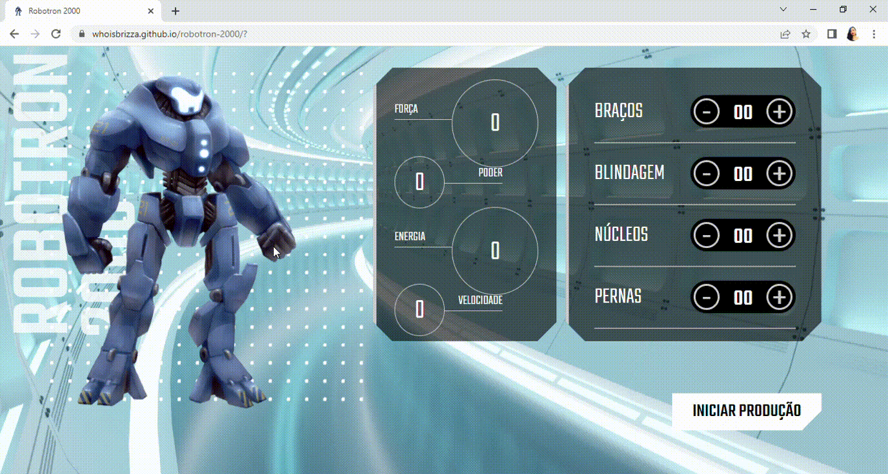

# Programa Desenvolve 2023 - Robotron-2000

Repositório criado com o objetivo de registrar meu progresso no Programa Desenvolve 2023 do Grupo Boticário em parceira com a Alura praticando o que foi abordado nas aulas do curso JavaScript: manipulando o DOM.

 

## 📝 Link
- [Demonstração](https://whoisbrizza.github.io/robotron-2000/)

  

